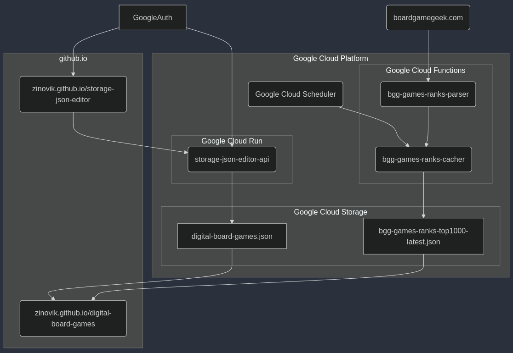

```
flowchart TB

    BoardGameGeek(boardgamegeek.com)
    GoogleAuth

    subgraph Google Cloud Platform
        subgraph Google Cloud Storage
            digital-board-games.json
            bgg-games-ranks-top1000-latest.json
        end
        subgraph Google Cloud Functions
            Cacher(bgg-games-ranks-cacher)
            Parser(bgg-games-ranks-parser)
        end
        subgraph Google Cloud Run
            StorageJsonEditorApi(storage-json-editor-api)
        end
        GoogleCloudScheduler(Google Cloud Scheduler)
    end

    subgraph github.io
        DigitalBoardGames(zinovik.github.io/digital-board-games)
        StorageJsonEditor(zinovik.github.io/storage-json-editor)
    end

    StorageJsonEditor --> StorageJsonEditorApi
    GoogleAuth --> StorageJsonEditor
    StorageJsonEditorApi --> digital-board-games.json
    GoogleAuth --> StorageJsonEditorApi

    digital-board-games.json --> DigitalBoardGames
    bgg-games-ranks-top1000-latest.json --> DigitalBoardGames

    GoogleCloudScheduler --> Cacher
    Parser --> Cacher
    BoardGameGeek --> Parser

    Cacher --> bgg-games-ranks-top1000-latest.json
```

This application requires 2 files:

**DIGITAL_BOARD_GAMES_URL** - a map of games with the arrays of places where to play it:

```typescript
interface DigitalBoardGamesData {
  [name: string]: string[];
}
```

**BGG_GAMES_RANKS** - an object with the array of games with the bgg rank

```typescript
interface BGGGamesRanksData {
  date: string;
  games: {
    rank: number;
    name: string;
    year: string;
    id: string;
  }[];
}
```

### create bucket, setup cors, check the bucket's cors:

```bash
gcloud storage buckets create gs://digital-board-games --location=europe-central2
gcloud storage buckets update gs://digital-board-games --cors-file=cors_file.json
gcloud storage buckets describe gs://digital-board-games --format="default(cors_config)"
gcloud storage buckets update gs://digital-board-games --versioning
```
